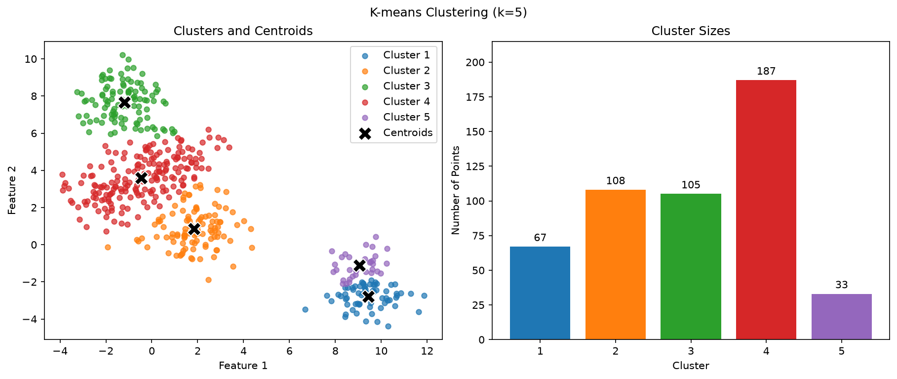

# K-Means Clustering from Scratch in Python

A from-scratch implementation of K-means clustering using **NumPy**, **Pandas**, and **Matplotlib**. Point assignment and centroid updates are implemented manually; **Scikit-learn** is used only for clustering evaluation metrics.

This project explores unsupervised learning by grouping similar points without target labels.

## Project Structure

```text
kmc/
├── cluster_data.csv      # Numeric dataset with Feature 1 and Feature 2
├── main.py               # Clustering, evaluation, and visualization
├── readme.md             # Documentation and study notes
└── kmc_evaluation.png    # Generated when the script runs
```

## Features & Implementation Details

1. **Dataset Loading:** Loads `cluster_data.csv` from the script's directory and converts its two numeric feature columns into a NumPy array.
2. **Centroid Initialization:** Selects five distinct data points as initial centroids using random seed `42` for reproducible results.
3. **Point Assignment:** Calculates the Euclidean distance from each point to every centroid and assigns it to the nearest cluster.
4. **Centroid Updates:** Replaces each nonempty cluster's centroid with the mean of its assigned points. Empty clusters retain their previous centroid.
5. **Convergence:** Repeats assignment and updates until centroids are unchanged within `np.allclose` tolerance, or the maximum of 100 iterations is reached.
6. **Evaluation:** Assigns points to the final centroids, prints clustering metrics, and reports the number of points in each cluster.
7. **Visualization:** Displays cluster assignments and centroids alongside a cluster-size bar chart, and saves the figure as `kmc_evaluation.png`.

## Mathematics

### Euclidean Distance

The distance between a point $x$ and a centroid $\mu$ is:

$$
d(x, \mu) = \sqrt{\sum_{j=1}^{p}(x_j - \mu_j)^2}
$$

Here, $p$ is the number of features. Each point is assigned to the centroid with the smallest distance.

### Centroid Update

For a nonempty cluster $C_i$, its centroid becomes:

$$
\mu_i = \frac{1}{|C_i|}\sum_{x \in C_i}x
$$

### K-Means Objective

The algorithm aims to reduce the within-cluster sum of squared distances, also called **inertia**:

$$
J = \sum_{i=1}^{k}\sum_{x \in C_i}\lVert x - \mu_i \rVert^2
$$

Initialization can affect the final result; this implementation uses one seeded initialization.

## Evaluation Metrics

| Metric | What it measures | Interpretation |
| --- | --- | --- |
| Inertia | Sum of squared distances to assigned centroids | Lower indicates more compact clusters for a fixed dataset and value of `k` |
| Silhouette score | Cohesion within a cluster compared with separation from other clusters | Higher is better; ranges from -1 to 1 |
| Davies–Bouldin index | Average similarity between each cluster and its most similar other cluster | Lower is better |
| Calinski–Harabasz index | Between-cluster dispersion relative to within-cluster dispersion | Higher is better |

The three Scikit-learn metrics are computed only when there are between 2 and `n_samples - 1` nonempty clusters. These metrics evaluate cluster structure without ground-truth labels.

Example results for the included dataset with `k = 5` and seed `42`:

```text
K-means evaluation (k=5, iterations=13)
Inertia (within-cluster sum of squares; lower is better): 1285.1268
Silhouette score (higher is better): 0.4337
Davies-Bouldin index (lower is better): 0.9104
Calinski-Harabasz index (higher is better): 1265.1942
Cluster 1: 67 points
Cluster 2: 108 points
Cluster 3: 105 points
Cluster 4: 187 points
Cluster 5: 33 points
```

## Visualization

The generated figure contains two panels:

- **Clusters and Centroids:** Points are colored by cluster; black `X` markers show the final centroids.
- **Cluster Sizes:** Bars show how many points belong to each cluster.



## Requirements

Install the dependencies in your active Python environment:

```bash
python -m pip install numpy pandas matplotlib scikit-learn
```

## How to Run

From the repository root:

```bash
python kmc/main.py
```

Or from the `kmc` directory:

```bash
python main.py
```

The script prints evaluation results, saves `kmc/kmc_evaluation.png`, and opens the visualization when an interactive plotting backend is available.

For execution without a display:

```bash
MPLBACKEND=Agg python kmc/main.py
```

## Configuration & Assumptions

- Change `k = 5` in `main.py` to select a different number of clusters. It must be between 1 and the number of data points.
- Change `max_iters = 100` to adjust the iteration limit.
- Change the seed passed to `np.random.default_rng(42)` to explore other initializations.
- The current script expects numeric, finite data with no missing values and at least two feature columns for plotting.
- Features are used in their original scale. Different feature scales can influence Euclidean distance and cluster assignments.
- With additional feature columns, clustering and metrics use all columns, while the scatter plot displays only the first two.

## Learning Objectives

- Understand unsupervised learning and K-means clustering.
- Implement Euclidean distance and nearest-centroid assignment.
- Update centroids using cluster means.
- Recognize convergence and the effect of initialization.
- Interpret clustering metrics and visualize cluster structure.
